# B.Tech-Final-year-Project
*Project on application of Estimation algorithms in Chemical Engineering*
<body>
    <h1>Chemical Engineering and Estimation Algorithms</h1>
    
Chemical engineering is a discipline that applies mathematical models and techniques to optimize chemical processes. It requires a deep understanding of chemistry, physics, and mathematics.

    
One valuable technique in chemical engineering is application filtering. This mathematical method estimates system states and predicts future values based on past measurements.

    <h3>Importance of Estimation Algorithms in Chemical Engineering</h3>
    
Chemical engineering deals with complex systems that require monitoring and control for optimal function. These systems often have multiple inputs and outputs, along with disturbances and uncertainties. To make informed control decisions, accurate estimates of system states are crucial.

    
Kalman filters (KF), Extended Kalman Filters (EKF), and Unscented Kalman Filters (UKF) are powerful application filtering tools used in chemical engineering.

    <h3>Types of Kalman Filters</h3>
   <ul>
    <li>
      <strong>Kalman Filter (KF):</strong> This widely used technique estimates a system's state based on noisy measurements. It's a recursive algorithm that updates the state estimate with new measurements.
       
      
      [1]
    </li>
    <li>
      <strong>Extended Kalman Filter (EKF):</strong> An extension of the KF for non-linear systems. It approximates the non-linear system linearly and estimates the state using the same KF algorithm.
    </li>
    <li>
      <strong>Unscented Kalman Filter (UKF):</strong> Another extension for non-linear systems. It uses unscented transformation to approximate the probability distribution of the state estimate. The UKF can be more accurate than the EKF, especially for highly non-linear systems.
       
      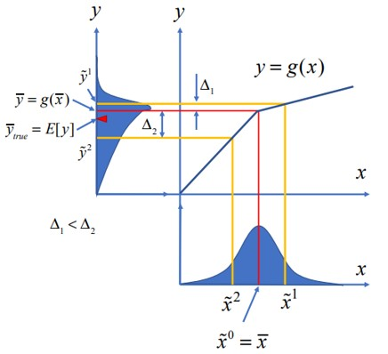
      [5]
    </li>
  </ul>
  <h3>Literature Referred</h3>
      
Kalman Filter has been an area of research for several decades and various papers have been published on it. While working on this project I referred to:

<ol>
  <li>Constrained Nonlinear State Estimation Using Ensemble Kalman Filters [2]</li>
  <li>Constrained nonlinear state estimation based on the UKF approach [3]</li>
</ol>

<h4>Key Takeaways from Constrained Nonlinear State Estimation Using Ensemble Kalman Filters [2]:</h4>

<ul>
  <li>Proposed a constrained recursive formulation of the ensemble Kalman filter (EnKF) that retains the advantages of unconstrained EnKF while systematically dealing with bounds on the estimated state variables.</li>
  <li>The performance of the proposed constrained EnKF is compared with the performances obtained using the recursive constrained formulations available in the literature using two benchmark examples from the literature (a gas-phase reactor and an isothermal batch reactor), which involve constraints on the estimated state variables.</li>
  <li>When compared, the performance of the proposed C-EnKF formulation was found to be significantly better than those obtained using RNDDR and C-UKF formulations. Furthermore, the performance of the proposed C-EnKF scheme was found to be satisfactory when employed for state estimation in a system having constraints on process noise.</li>
</ul>

<h4>Key Takeaways from Constrained nonlinear state estimation based on the UKF approach [3]:</h4>

<ul>
  <li>Overview of several UKF based nonlinear estimation algorithms as an alternative to the EKF.</li>
  <li>Suggested a reformulation of the correction step which can be applied to all the presented UKF algorithms, presented a QP formulation of the NLP UKF (which also can be applied to all of the presented UKF algorithms).</li>
  <li>Proposed alternatives to realize constraints within the UKF approach.</li>
 </ul>
 <h3>Mathematical Formualtion </h3>
  <h4>Bayes Filter</h4>

  
The Kalman Filter is based on the Bayes theorem and Markov Assumption. From the Bayes theorem we get the following equation:

  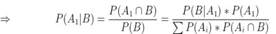

  
The above equation shows the probability of event A1 occurring when the event B has occurred. The above result may then be extended to multiple events, whose detailed derivation has been given in Appendix-1.

  
On the other hand, the Markov Assumption may be understood using Figure:

  
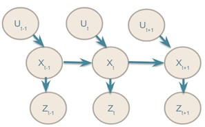

  
We see that at time <i>t-1</i> when we give input U, then we get state X at <i>t-1</i> and its measurement Z at time <i>t-1</i>. Similarly, at time <i>t</i>, we give input and obtain the state X at time <i>t</i>, whose measurement is Zt.
  

  
Thus on observing the pattern we see that state X at time t depends upon state X at time t-1 and input U at time t while the measurement at time t depends on the state X at time t only .Mathematically it may be represented as : 

   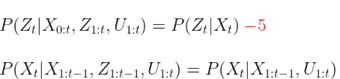

   
The final formulation of the Bayes filter is obtained by the combination of the Bayes theorem and Markov's assumption which is described in detail in Appendix-1.  
   

  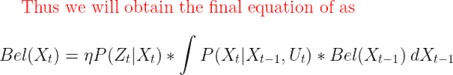
  
 From this we observe that  Posterior of State = Likelihood of state * (Previous Estimation)

  Kalman Filter is for linear systems where - the state X and the measurement Z can be represented linearly as-
  ( w in Z denotes the error in measurement)

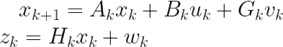
 
  <h4>Kalman  Filter</h4>
  
The Kalman Filter mathematical derivation is discussed in detail in Appendix-2. The basic algorithm for Kalman Filter can be represnted as :-

  
  [6]
  <h4>Unscented Kalman  Filter</h4>
  
The Unscented Kalman Filter (UKF) is a variant of the Kalman filter that allows for nonlinear systems to be estimated. Here is the mathematical formulation of the UKF:
Let us assume we have a system described by the following state equation:

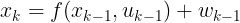
 
where x k is the state at time k , f is the nonlinear state transition function, u k is the control input at time k, and w k-1 is the process noise at time k-1.

 We also have measurements that are related to the state through the following observation equation:

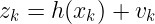

where z k is the measurement at time k, h is the nonlinear observation function, v k and  is the measurement noise at time k.
  The UKF estimates the state of the system by maintaining a probability distribution over the possible states. Specifically, the UKF maintains a Gaussian distribution over the state at each time step, with mean x k  and covariance P k . The UKF works by propagating the mean and covariance of the state distribution through the nonlinear state transition function f and the nonlinear observation function h using a set of carefully chosen sigma points. These sigma points are chosen to capture the mean and covariance of the distribution, and to propagate them through the nonlinear functions in a way that preserves their moments.

  The propagation of the mean and covariance through the nonlinear functions is done in two steps: the prediction step and the update step.

  

  <h4>Recursive Algorithm for UKF implementation </h4>
<ol>
  <li>Given x and Pt-1, sample sigma points are found by computing eigenvalues and eigenvectors of Pt-1.</li>
  
  <li>Propagate the sigma points through the nonlinear model to obtain 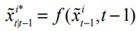</li>
  
  <li>From the (2n+1) sigma points, compute the mean and variance.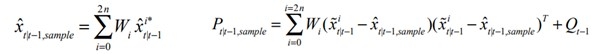</li>
  
  <li>Sample again (2n+1) sigma points for Pt | t-1, sample.</li>
  
  <li>Transform the propagated sigma points to output estimate based on the nonlinear measurement equation, and compute the estimated output.</li>
  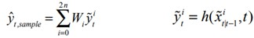
  
  <li>Evaluate the innovation covariance and the cross-covariance by using (2n +1) points of propagated output estimates to find the Kalman gain.</li>
  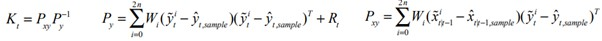
  <li>Update the state estimate with the Kalman gain.</li>
  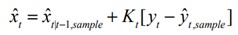
  <li>Update the a posteriori covariance.</li>
  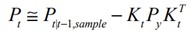
</ol>
<h3>Results and Discussion
</h3>
  <h4>Implementing Kalman Filter on One Dimensional moving body</h4>
  
<em>(refer to  Jupyter notebook named Basics)</em>

  
The example of a moving body was modeled in Python Code.
    The Python Code [4] was referred to and  was formulated as : 
  

  <ul>
    <li>Initially, the system's state was modeled as a Gaussian distribution, as depicted in the Jupyter notebook titled "Basics." Subsequently, an error within a specified range was introduced, visually represented by a graph in the notebook.</li>
    <li>Following this, both predicted and measured values were obtained, reflecting the system's state. Gaussian multiplication was then employed to determine the optimal result, visually denoted by the dotted lines in the figure.</li>
    <li>The subsequent analysis involved observing the variation of the optimal value as the gain (represented by K) was adjusted. The figure below  illustrates this variation.</li>
    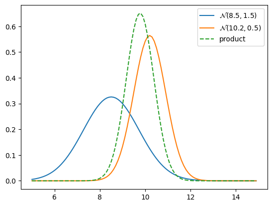
    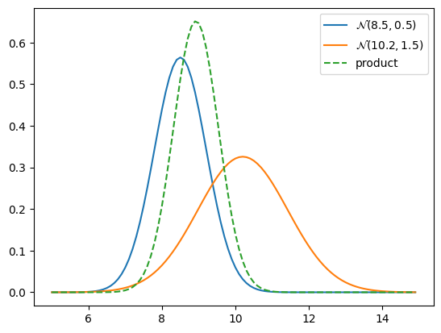
    <li>From the insights gleaned from the graphs, it can be concluded that the optimal result is influenced by both the predicted and measured values, as well as the gain K, which reflects the level of trust or certainty in these values.</li>
   <li> Additionally, it was observed that the variance of the optimal result is typically lower (indicating higher precision) than both the predicted and measured values, as evidenced in the figure.</li>
    <li>Moreover, the figure demonstrates that when there is a higher level of certainty in one value, whether predicted or measured, the optimal graph tends to align more closely with the value characterized by higher certainty.</li>
  </ul>

  <h4>Implementing Kalman Filter on Second Order reaction in CSTR
  </h4>
  
<em>(refer to Part 1 of the Jupyter notebook named KF_UKF_Compare)</em>

  
Taking the example 7.1 of a 2-state CSTR from the paper Constrained nonlinear state estimation based on the UKF approach [3]. 
  
  Here we study variation of  concentration in a second order reaction with time using KF.
  

  <ul>
  <li>The gas phase phase reaction is 2A → B  with , where k = 0.16 and the rate for the reaction is specified as r =k Pa2</li> 
  <li>The state vector in the above equation will be  x= [Pa , Pb]T and its initial value is x= [3 , 1]T
 On applying the filter the following result was obtained-  
</li>
 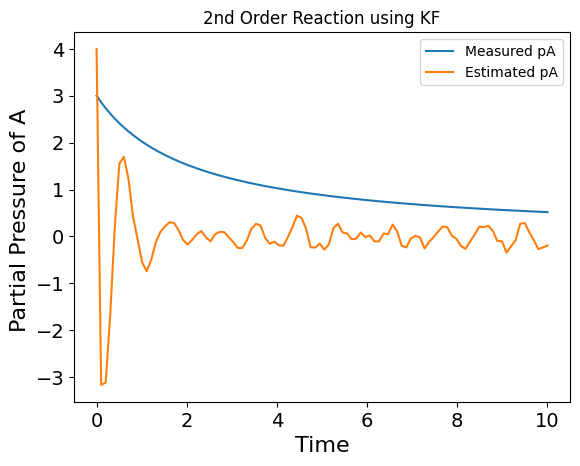
 <li>Thus we observe from the above obtained plot that even though the initial guess of the estimation was incorrect still the  filter tends to correct the estimation which eventually approaches the measurement value . But even after correction the estimation still maintains a certain degree of error and does not attain the actual measurement value. </li>

  </ul>

  <h4>Implementing Unscented Kalman Filter on First Order reaction 
  </h4>
  
<em>(refer to Part 2 of the Jupyter notebook named KF_UKF_Compare)</em>

  
After implementing simple KF we head over to UKF which we will eventually prove is much more accurate than KF.

  First UKF was implemented on a simple first order reaction system having initial concentration as 3 units and we observed the response as we changed the initial guess and the error in the model used for estimation .
  

  
<em>(in the code three comments named MODIFY are given , change the numerical values in the same line , to respectively change the erros in the initial guess and model error )</em>

  <ul>
  <li>Graph showing Concentration variation with time , having large deviation of initial guess  and less model error.
  </li>
  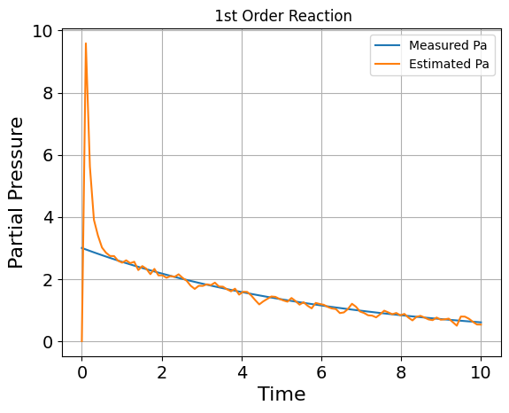
  <li>Graph showing Concentration variation with time , having less deviation of initial guess  and large model error.      
  </li>
  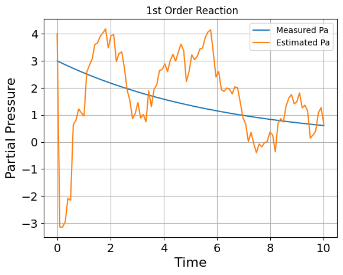
  <li> Graph showing Concentration variation with time , having less deviation of initial guess  and less model error.   
  Hence best estimation   

  </li>
  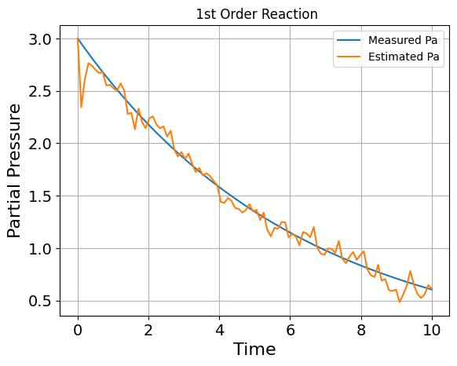
  <li>Thus in figure 1 we see that the initial Concentration guess is highly inaccurate but the estimation model itself has less noise / errors hence the estimation quickly corrects itself and heads along the same path as measured value while maintaining a minimum amount of error.</li>

  <li>While on observing figure 2 we see that the initial guess of the model is more accurate than the previous case but the model itself makes more noisy estimation hence we don't get a stable value i.e value which has less degree of error.</li>

 <li>  From figure 3 we see that  the initial guess is accurate and the model has least error hence giving the best estimation among all the cases .</li>

 <li>  Thus from the above cases we observed how variation in initial guess and the model error will affect the final results.Hence using these we will head over to solve a problem which was solved in the research paper [3].
 </li>
 </ul>

  <h4>Implementing Unscented Kalman Filter on 2 State CSTR
  </h4>
  
<em>(refer to  Jupyter notebook named UKF_Paper)</em>

  
 Taking the example 7.1 of a 2-state CSTR from the paper Constrained nonlinear state estimation based on the UKF approach [3]. Here we study variation of  concentration in a second order reaction with time using UKF.

  <ul>
  <li>The gas phase phase reaction is 2A → B  with , where k = 0.16 and the rate for the reaction is specified as r =k Pa2</li> 
  <li>The state vector in the above equation will be  x= [Pa , Pb]T and its initial value is x= [3 , 1]T
  </li>
  <li>The other parameters were initialized as</li>
  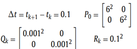
  <li>Thus the above problem was solved using unconstrained UKF and the following results were published by the authors [3] as shown in figure </li>
  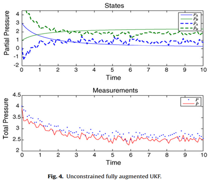[3]

   <li>On simulating the above problem using my own code for UKF the results obtained are as shown in the figures below.
  </li>
  <li>Graph showing partial pressure variation with time , for a second order reaction ,
  using UKF .  
  </li>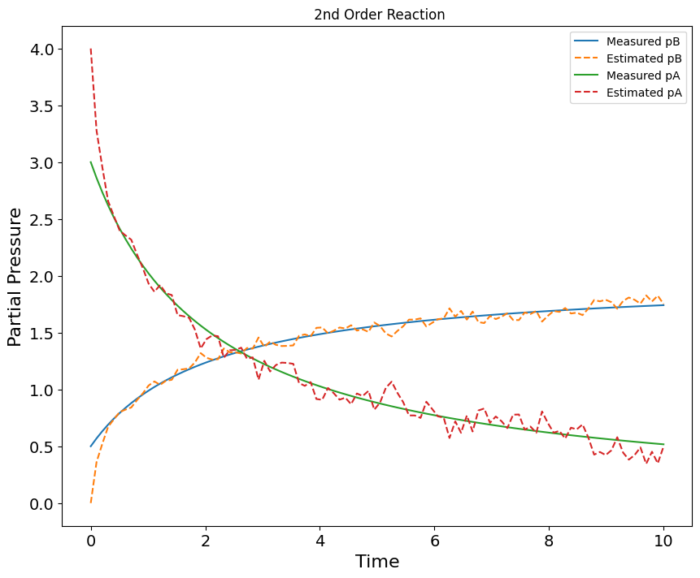
   <li>Graph showing Total pressure variation with time , for a second order reaction ,using UKF.  
  </li>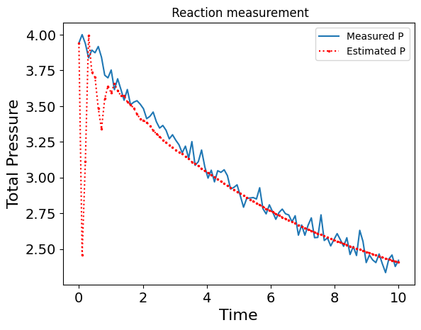
 </ul>
 
Thus on comparing above  figures we obtain similar results and we may make the following conclusions form these results :
  

  <ul>
  <li>Even though the initial guess of the partial pressure is flawed the estimation model quickly catches up to the real measurement value and always maintains it in a certain error range.</li>
  <li>The total pressure measurement itself has some error while the estimation model in 4.10 initially tends to have a larger error; it quickly corrects itself to have least error and maintains it throughout the time interval.
  </li>
  <li>Hence UKF gives very accurate results.
  </li>
  </ul>
  
Thus now we have established that UKF gives us accurate results. We will compare the results between KF and UKF to concretize that  UKF is the best estimator.
  

  <h4>Comparing Unscented Kalman Filter and Kalman Filter</h4>
  
<em>(refer to Part 3 and Part 4 of the Jupyter notebook named KF_UKF_Compare)</em>

  
In earlier part we solved the same problem as mentioned in the research paper [3] hence we will be comparing the results obtained  in the two simulations .

 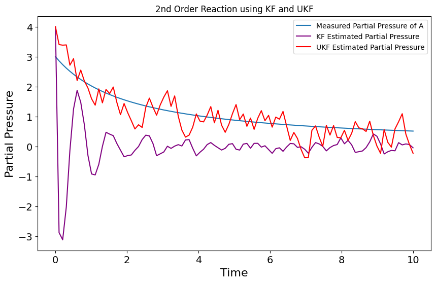
  
Thus from the above figure  we can see that the initial guess of both the estimators is same but as time varies the UKF from the very start approaches them measurement values on the other hand the KF does not approach the measurement values immediately , while even on the later stages it maintains a error much more than UKF. 

  <h3>Project Conclusion</h3>

The study indicates that the Unscented Kalman Filter (UKF) algorithm outperforms the Kalman Filter (KF) algorithm in estimating reactor system states. The UKF algorithm provides more accurate and reliable estimates, particularly for systems with high non-linearities and uncertainties. Additionally, the UKF algorithm demonstrates improved computational efficiency.

The findings have significant implications for chemical engineering applications. Accurate estimation of reactor state variables is essential for effective process control and optimization. Application filtering techniques, such as UKF, offer valuable tools for achieving this goal. The success of the UKF algorithm underscores its potential for similar chemical engineering applications.

In conclusion, this project highlights the utility of filtering techniques in chemical engineering. The results offer insights into the performance of different filtering algorithms and stress the importance of selecting the appropriate algorithm for specific systems. Furthermore, the findings suggest that UKF may be superior to KF for complex, non-linear systems like chemical reactors. Future research can explore other application filtering techniques to further enhance state estimation accuracy and efficiency in chemical engineering.

  <h3>References</h3>
 
  <ol>
    <li>
      Wikipedia contributors, “Kalman filter,” Wikipedia, Mar. 18, 2024. <a href="https://en.wikipedia.org/wiki/Kalman_filter">(https://en.wikipedia.org/wiki/Kalman_filter))</a>
    </li>
    <li>
    J. Prakash, S. C. Patwardhan, and S. L. Shah, “Constrained nonlinear state estimation using Ensemble Kalman filters,” Industrial & Engineering Chemistry Research, vol. 49, no. 5, pp. 2242–2253, Feb. 2010, doi: 10.1021/ie900197s. 
    </li>
    <li>S. Kolås, B. A. Foss, and T. S. Schei, “Constrained nonlinear state estimation based on the UKF approach,” Computers & Chemical Engineering, vol. 33, no. 8, pp. 1386–1401, Aug. 2009, doi: 10.1016/j.compchemeng.2009.01.012.</li>
    <li>Rlabbe, “GitHub - rlabbe/Kalman-and-Bayesian-Filters-in-Python: Kalman Filter book using Jupyter Notebook. Focuses on building intuition and experience, not formal proofs.  Includes Kalman filters,extended Kalman filters, unscented Kalman filters, particle filters, and more. All exercises include solutions.,” GitHub. 
    <a href="https://github.com/rlabbeKalman-and-Bayesian-Filters-in-Python">(https://github.com/rlabbeKalman-and-Bayesian-Filters-in-Python))</a>
    </li>
    <li>
      Massachusetts Institute of Technology d’Arbeloff Laboratory and H. Asada, “MIT d’Arbeloff Laboratory,” MIT D’Arbeloff Lab, Mar. 04, 2021. <a href="https://darbelofflab.mit.edu/">(https://darbelofflab.mit.edu/)</a> 
    </li>
    <li>Z. Zhang, J. Jiang, J. Wu, and X. Zhu, “Efficient and optimal penetration path planning for stealth unmanned aerial vehicle using minimal radar cross-section tactics and modified A-Star algorithm,” ISA Transactions, vol. 134, pp. 42–57, Mar. 2023, doi: 10.1016/j.isatra.2022.07.032.</li>
  </ol>
</body>

