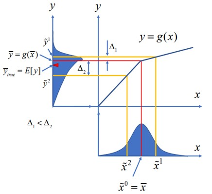

# B.Tech-Final-year-Project
*Project on application of Estimation algorithms in Chemical Engineering*

<body>
    <h1>Chemical Engineering and Estimation Algorithms</h1>
    
Chemical engineering is a discipline that applies mathematical models and techniques to optimize chemical processes. It requires a deep understanding of chemistry, physics, and mathematics.

    
One valuable technique in chemical engineering is application filtering. This mathematical method estimates system states and predicts future values based on past measurements.

    <h3>Importance of Estimation Algorithms in Chemical Engineering</h3>
    
Chemical engineering deals with complex systems that require monitoring and control for optimal function. These systems often have multiple inputs and outputs, along with disturbances and uncertainties. To make informed control decisions, accurate estimates of system states are crucial.

    
Kalman filters (KF), Extended Kalman Filters (EKF), and Unscented Kalman Filters (UKF) are powerful application filtering tools used in chemical engineering.

    <h3>Types of Kalman Filters</h3>
    <ul>
        <li><strong>Kalman Filter (KF):</strong> This widely used technique estimates a system's state based on noisy measurements. It's a recursive algorithm that updates the state estimate with new measurements.
         
        
        </li>
        <li><strong>Extended Kalman Filter (EKF):</strong> An extension of the KF for non-linear systems. It approximates the non-linear system linearly and estimates the state using the same KF algorithm.</li>
        <li><strong>Unscented Kalman Filter (UKF):</strong> Another extension for non-linear systems. It uses unscented transformation to approximate the probability distribution of the state estimate. The UKF can be more accurate than the EKF, especially for highly non-linear systems.
         
         </li>
    </ul>
</body>

